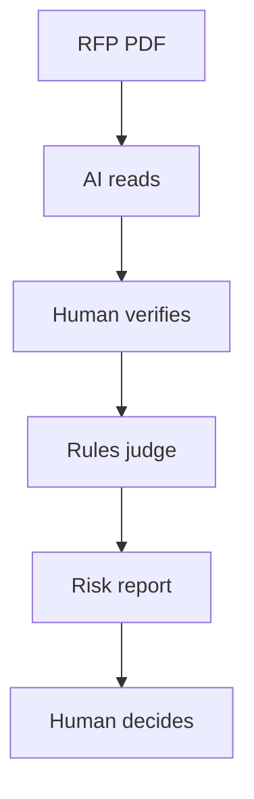

# tender-copilot


[](https://github.com/ajal2/tender-copilot/actions/workflows/ci.yml)

> Indian government RFPs are 100-page documents where a single buried clause
> disqualifies you. **tender-copilot reads one and returns: bid or skip, your
> score against the qualification gate, and the exact clauses you're about to be
> rejected on.** Validated on a live ₹3 Cr bid.

Plenty of tender tools generate documents. Here the PDFs are the boring
byproduct; the product is the decision, plus the risk model that catches what a
tired human misses.

---

## The hero output (real bid, zero install)

```text
BID REJECT-RISK REPORT  ·  704474-E1-168-MCS-2026-27
50 TPD C&D Waste Processing Plant + 10-yr O&M — Sangareddy Cluster (11 ULBs)
==============================================================================
VERDICT:  CONDITIONAL BID — eligible & over the gate, but fix the risks below first
SCORE:    80/100  (gate 70; margin +10)
RISKS:    1 HIGH, 2 MEDIUM, 1 LOW
==============================================================================
REJECT RISKS  (●HIGH ◐MEDIUM ○LOW)
  ● [HIGH]  Bid claims a document that isn't enclosed
            The compliance letter says "PF challan enclosed" and points to Slot 2
            — but it isn't there. The bid also certifies all statements true.
  ◐ [MEDIUM] Missing: recent PAID PF challan
            Required only in eligibility prose — off the checklist, easy to miss.
  ◐ [MEDIUM] Document-fee proof unclear: ₹2,000 vs RFP ₹11,800
  ○ [LOW]    Low-confidence extraction: positive net worth — needs a human
```

Full output, with the score breakdown and eligibility gates, is in **[examples/sangareddy_risk_report.md](examples/sangareddy_risk_report.md)**.
Every one of those four was a real defect on the actual submitted bid.

```bash
git clone https://github.com/ajal2/tender-copilot.git && cd tender-copilot
python -m tender_copilot          # prints the report above. no deps, no keys.
```

---

## Why this is hard (and not just templating)

- The RFP works against you: 100+ pages, formatting that changes by department,
  obligations scattered across prose, tables, and annex indices.
- The clause that sinks you is rarely on the checklist, which is why every
  requirement gets ranked by where it appears (checklist vs. buried prose).
  That placement changes the real risk.
- The most catchable defect isn't even a missing file. It's the bid *claiming*
  a file it didn't attach, so the engine checks every claim against what was
  actually assembled.
- Wrong answers cost money here. A rejected bid wastes the non-refundable
  tender fee and days of senior time, so
  the extractor carries per-field confidence and anything it's unsure of goes
  to a human queue instead of a guess.

---

## How a bid flows through it



Five steps: the AI reads the 100-page RFP into structured facts, a human
verifies them, deterministic rules audit the bid against those facts, and a
person makes the final call. Anything read with low confidence skips straight
to the human instead of being trusted.

One configurable core; JBSS is just a profile + fixture. Point it at another
company or another tender by swapping JSON. Nothing in the engine is hardcoded
to one bidder. Full walkthrough in **[docs/architecture.md](docs/architecture.md)**.

---

## Built from a real bid

The test case is the **Sangareddy 50 TPD C&D tender** (Tender ID 704474), a
live ₹3 Cr municipal contract bid as a JBSS LLP + Lochab Stone joint venture.
The engine was built after that bid went in, encoding it as the first labelled
fixture: it matches the 80/100 score we computed by hand (gate 70), and it
reproduces, under test, the four compliance defects that human review caught
on the real bid. Future bids get from the engine what this one got by hand.
*(The bid won. The engine takes no credit for that: it did not exist when the
bid went in.)*
The story is in **[docs/case-study-sangareddy.md](docs/case-study-sangareddy.md)**
and the economics in **[docs/business-case.md](docs/business-case.md)**.

---

## Repo map

```
tender_copilot/      the engine
  schema.py            data model (the core idea: requirements ranked by where they appear)
  evaluate.py          rubric → score + gap reasons
  audit.py        ★    reject-risk + cross-doc contradiction + fail-loud
  extract.py           JSON loaders; PDF→schema is the documented research stage
  report.py            renders the hero output
fixtures/            Sangareddy tender + submission (reviewed extraction output)
profiles/            synthetic, public-safe company capability profile
evals/               back-test: run on real tenders, assert the catches
docs/                architecture · business case · case study
```

## Scope & honesty

Public-safe by design: **no PANs, signatures, financial statements, or
notarised documents** live here. The profile is synthetic; fixtures carry only
eligibility-relevant facts from the public tender. PDF extraction is the open
research surface and is deliberately left as a human-reviewed stage rather than
faked. See [evals/](evals/) for what's actually measured.

MIT licensed.
