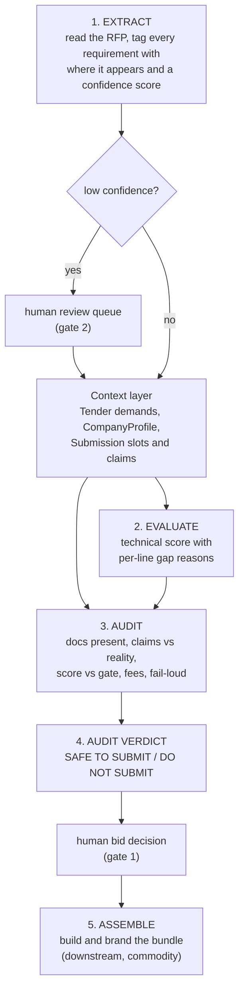

# Architecture

The entire system is **five stages and two human gates**.

**Gate 1, the human's call.** The audit answers one question — *is this safe to
submit?* Any HIGH or MEDIUM flag means `DO NOT SUBMIT`; a clean pass means
`SUBMIT`. Whether to actually pursue the tender stays with the team. We do not
automate the decision to risk the non-refundable fee.

**Gate 2, extraction review.** Any field parsed below the confidence floor is
surfaced, never trusted. The fixtures in `fixtures/` are the *reviewed* output of
stage 1.

## The one idea that makes it more than a checklist

Every `Requirement` carries a `source`: `CHECKLIST` (named in the formal document
list / annexure index) or `PROSE` (buried in an eligibility paragraph). The same
missing document is ranked **HIGH** if it's on the checklist and **MEDIUM** if
it's only in prose. That is how real evaluators behave, and the prose-buried
clause is the one humans actually miss. This single field is why the output
reads like judgement, not a `grep` for annexure numbers.

## Data model (`schema.py`)

- **`Tender`**: `requirements`, `scoring`, `minimums` (hard gates), `emd`,
  `doc_fee`, `gate`. The structured form of a messy PDF.
- **`Requirement`** carries `id`, `description`, **`source`**, `doc_id`, and
  `confidence`. `doc_id` links a demand to the artifact that satisfies it.
- **`ScoringItem`** is either value-driven (`bands` mapping values to marks) or
  presence-driven (`fixed`), so the score stays explainable line by line.
- **`CompanyProfile`**: `metrics` (turnover, capacity and so on) and
  `documents_available`, meaning what you *hold*.
- **`Submission`**: `slots` (what you *assembled*), `claims`, `emd_paid`,
  `fee_paid`. The gap between `documents_available` and what's in `slots` is
  exactly how "you own the PF challan but didn't attach it" gets caught.
- **`Claim`** is a statement the bid makes about itself, checked against reality.

## Audit logic (`audit.py`), in the order it runs

1. **Hard eligibility gates** come first. Fail one and it's `DO NOT SUBMIT`
   (turnover, capacity, and the rest) — you can't win as-is.
2. **Required-doc coverage**: a missing document is HIGH if it was on the
   checklist, MEDIUM if it only appeared in prose.
3. **Contradictions.** A claim that asserts a document that isn't enclosed is HIGH.
4. **Score vs gate**: below the gate is HIGH, because the price bid never opens.
5. **EMD and fees**: a shortfall or an unreconciled amount is HIGH or MEDIUM.
6. **Fail-loud**: any low-confidence requirement becomes a LOW review item.

Verdict: `DO NOT SUBMIT` if any HIGH/MEDIUM flag remains — an ineligibility or a
below-gate score each raise one — else `SUBMIT`.

## Why it generalises

Nothing in the engine modules (schema, evaluate, audit, extract, report)
mentions JBSS or Sangareddy; `__main__.py` just points the demo at the bundled
fixture. A new tender is a new `*.tender.json`; a new bidder is a new profile.
The engine is the deployable core and the JSON is the per-client, per-tender
config. That is the forward-deployed pattern: one system adapted to many messy
realities.

## Deliberately out of scope

No UI, no multi-tenant SaaS, no autonomous bidding. PDF-to-schema extraction is
the hard research surface and is left explicit, not faked. Bundle assembly and
branding exist downstream but are commodity and intentionally thin.
